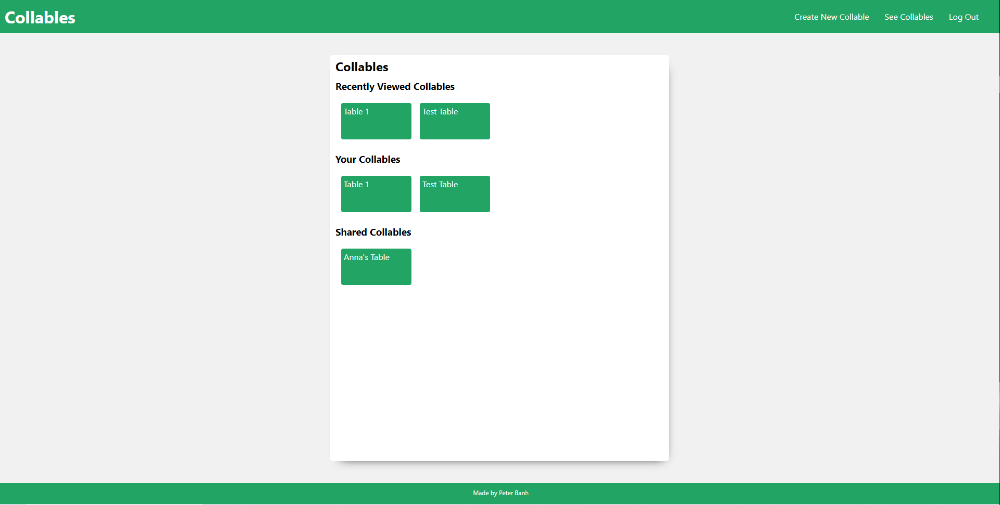
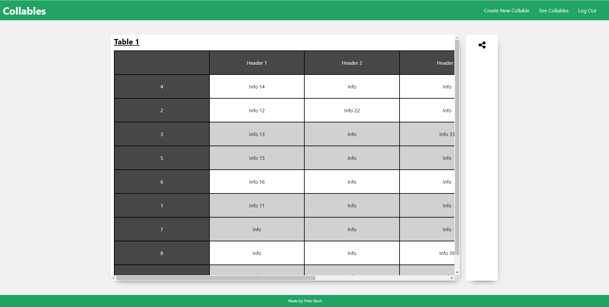

# Collables - General Assembly - SEI Project 4

Google spreadsheets is a great tool for teams to collaborate and share tabular data, especially when it is numerical data, or very simple text data. However, when the data consists of longer and more complicated text, a google spreadsheet is no longer a great way to collaborate and share this data unless the table is adjusted manually by a user, and even then, it can still be quite overwhelming to work with. This is the issue that Collables is intended to solve.

Collables is a web application that will provide users an alternative to google spreadsheet when working with tabular text data. It will allow users to import data from a google spreadsheet, and then work with the data on Collables, adding new rows and columns. Additionally, users shall still be able to collabroate, and see changes made to the table real time , but unlike google spreadsheets, users can adjust the table to their liking by moving rows and columns without affecting the view of other users.
This application was created for the final project of General Assembly's Software Engineering Immsersive (SEI) Program.

# Technologies Used
Collables is a web application uses a MERN (MongoDB, Express, React and Node.js) stack. The database is hosted on MongoDB Atlas and the web application is hosted on Heroku.

# Getting Started
You can find the web app deployed at Heroku [here](https://collable.herokuapp.com/).

As the application is still a work in progress, please user the following to login:
- Username:peboi, password:123

# Next Steps
At it's current state, Collables can only allow users to create custom tables, share them, and adjust their rows and columns - it is still very much in it's early stages. The next steps will include:
- Optimize table's apperance given some set of data.
- Allowing users to edit current data. This needs to be real time and therefore websocket must be used.
- Add new rows and columns. This needs to be real time and therefore websocket must be used.
- Save current view of the table.
- Implement OAuth so users can upload their own Google Spreadsheets
